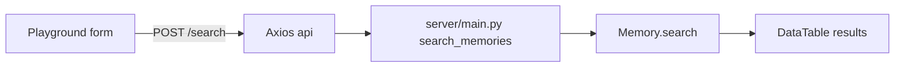

# Dashboard Playground 菜单

## 目标

在自托管 dashboard 左侧导航新增 **Playground**，用于按用户做语义搜索：填写 User ID、query，以及可选 `top_k` / `threshold`，点击 Search 后调用 `POST /search`，结果用表格列出。

## 数据流



请求体（使用推荐的 `filters`，不用已废弃的顶层 `user_id`）：

```json
{
  "query": "...",
  "filters": { "user_id": "..." },
  "top_k": 20,
  "threshold": 0.1
}
```

响应：`{ results: [{ id, memory, user_id, agent_id?, score, created_at, ... }] }`

## 改动文件

### 1. 导航 — [`server/dashboard/src/app/(root)/dashboard/components/main-nav.tsx`](server/dashboard/src/app/(root)/dashboard/components/main-nav.tsx)

在 ACTIVITY 数组中、Entities 之后新增一项：

- `title: "Playground"`
- `url: "/dashboard/playground"`
- `icon: FlaskConical`（lucide-react）

### 2. 新页面 — `server/dashboard/src/app/(root)/dashboard/playground/page.tsx`

参照 [`memories/page.tsx`](server/dashboard/src/app/(root)/dashboard/memories/page.tsx) 的布局风格，做成按需搜索页（不自动请求）：

- **表单字段**
  - User ID（必填）
  - Query（必填）
  - top_k（可选，number，placeholder 如 `20`）
  - threshold（可选，number，placeholder 如 `0.1`）
- **Search 按钮**：校验 User ID + Query 非空后 `api.post`
- **状态**：`isLoading` / `results` / 是否已搜索过；初始展示 EmptyState 引导输入；loading 用 `TableSkeleton`；无结果用 EmptyState
- **表格列**（`DataTable`）：Content、User、Score、Created（Score 格式化为两位小数）
- 可选：点击行打开与 Memories 类似的详情 Sheet（只读展示 memory 全文与 metadata），保持轻量

### 3. API 常量 — [`server/dashboard/src/utils/api-endpoints.ts`](server/dashboard/src/utils/api-endpoints.ts)

```ts
export const SEARCH_ENDPOINTS = {
  BASE: "/search",
} as const;
```

### 4. 类型 — [`server/dashboard/src/types/api.ts`](server/dashboard/src/types/api.ts)

新增：

```ts
export interface SearchMemory extends Memory {
  score?: number;
  run_id?: string;
}
```

### 5. Docker rewrite — [`server/dashboard/next.config.mjs`](server/dashboard/next.config.mjs)

在 `rewrites()` 中增加：

```js
{ source: "/search", destination: `${backend}/search` },
```

否则 Docker 部署下前端代理不到 `/search`。

## UI 约定

- `"use client"` + 现有 shadcn `Input` / `Label` / `Button` / `Card`
- 错误用现有 `toast` + `getErrorMessage`
- 样式与 Memories/Entities 一致（`font-fustat` 标题、`border-memBorder-primary` 等）
- 不引入新依赖

## 不在范围内

- 不改 `server/main.py` 的 `/search` 行为
- 不做 delete / update
- 不把 Playground 放进 CLOUD FEATURES（这是 OSS 可用能力）
