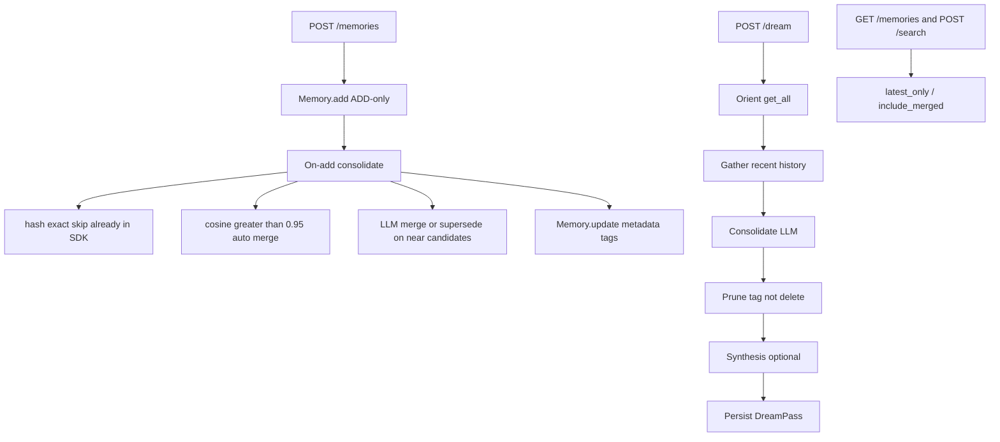

# OSS 记忆治理（Merge / Supersede / Synthesis）

按方案 V2 与你确认的范围：**治理引擎只放在 [`server/`](server/)**，[`mem0/`](mem0/) 只提供 metadata 写入与读取过滤。不改 SDK `add()` 的 ADD-only 提取流水线，避免把 LLM 治理绑进每次提取。



读语义与 Platform Dream 对齐（见 [`docs/platform/features/dream.mdx`](docs/platform/features/dream.mdx)）：

- 默认：返回 **active + superseded**，隐藏 **merged**
- `latest_only=true`：只返回 active（缺省 `governance_status` 视为 active）
- `include_merged=true`：三者都返回

不做：物理删除、调度器（由调用方 cron 打 `POST /dream`）、TypeScript SDK、审核 UI。

---

## 1. SDK 最小支撑（metadata + 过滤）

改 [`mem0/memory/main.py`](mem0/memory/main.py) 的 **sync + async** `get` / `get_all` / `search`（以及 `_get_all_from_vector_store` / `_search_vector_store`），模式照抄现有 `show_expired`：

- 新增参数 `latest_only: bool = False`、`include_merged: bool = False`
- 过取再后过滤（`fetch_limit = max(limit * 4, 60)`），缺字段视为 `active`
- 把治理字段提升到结果顶层（与 `expiration_date` 相同）：`governance_status`、`merged_into`、`superseded_by`、`synthesized_from`、`memory_kind`

抽一个小函数，避免 sync/async 各写一遍，例如 [`mem0/memory/governance_filters.py`](mem0/memory/governance_filters.py)：

```python
def memory_is_active(payload) -> bool:
    return payload.get("governance_status", "active") == "active"

def should_include_memory(payload, *, latest_only, include_merged) -> bool:
    status = payload.get("governance_status", "active")
    if latest_only:
        return status == "active"
    if status == "merged":
        return include_merged
    return True  # active + superseded
```

**不**在 SDK `add()` 里跑治理 LLM。新建记忆不强制写 `governance_status`；读取侧把缺失当 `active`，兼容存量数据。

公开签名变了，同 PR 更新 [`docs/open-source/python-quickstart.mdx`](docs/open-source/python-quickstart.mdx) / search 相关说明。

---

## 2. Server 治理层

新模块，不要继续膨胀 [`server/main.py`](server/main.py)（已 670+ 行）：

| 文件 | 职责 |
|------|------|
| [`server/governance/engine.py`](server/governance/engine.py) | Orient / Gather / Consolidate / Prune / Synthesize |
| [`server/governance/dedup.py`](server/governance/dedup.py) | hash + `vector_store.search` 余弦候选（阈值默认 0.95） |
| [`server/governance/actions.py`](server/governance/actions.py) | 把 merge/supersede/synthesize 写成 `Memory.update` / `Memory.add(infer=False)` |
| [`server/governance/prompts.py`](server/governance/prompts.py) | Consolidate / Synthesis JSON prompt |
| [`server/routers/dream.py`](server/routers/dream.py) | REST |

动作全部 **non-destructive**，只改 payload metadata：

```python
# merge: 规范记忆保持 active；被折叠的记 merged
{"governance_status": "merged", "merged_into": canonical_id, "governance_pass_id": pass_id}

# supersede: 旧事实标 superseded，默认检索仍可见
{"governance_status": "superseded", "superseded_by": new_id, "governance_pass_id": pass_id}

# synthesize: 新记忆与源并存
{"governance_status": "active", "memory_kind": "pattern", "synthesized_from": [...]}
```

打标必须走 [`Memory.update(..., metadata=...)`](mem0/memory/main.py)（只传治理字段，不传 `text`）；合成记忆用 `add(infer=False, metadata=...)`。不要用 `memory_type`（SDK 只允许 `procedural_memory`）。

**已验证：`update(metadata=)` 是 payload 顶层 merge，不是替换 `payload.metadata`。** Mem0 没有嵌套的 `payload.metadata`：`data` / `hash` / `text_lemmatized` / `user_id` 和用户自定义字段都在同一层 JSON。`_update_memory`（sync 与 async 相同）的顺序是：

1. `new_metadata = deepcopy(existing_memory.payload)` — 整包拷贝，含 `text_lemmatized`
2. `new_metadata.update(_strip_identity_keys(caller_metadata, ...))` — 只覆盖调用方给出的键；`user_id`/`agent_id`/`run_id`/`actor_id` 被丢掉
3. 再强制写回 `data`、`hash`、`text_lemmatized = lemmatize_for_bm25(data)`、`created_at`（保留）、`updated_at`（刷新）
4. `text=None` 时 `data` 取现有正文，因此 **metadata-only 打标会按原文重算 BM25 词元，不会清空**

pgvector 的 [`update()`](mem0/vector_stores/pgvector.py) 是 `SET payload = %s` **整列替换**。因此治理层 **禁止** 直接 `vector_store.update(payload={governance_status: ...})`：那样会抹掉 `text_lemmatized` 和其余字段，检索退化。只把增量键交给 `Memory.update`，由它 merge 后再把完整 payload 写回。

副作用：metadata-only 仍会重新 embed 同一段 `data`（`_update_memory` 无“跳过向量”分支）。正确性没问题，on-add 批量打标时注意延迟。

复用 `get_memory_instance().llm` 与 `.embedding_model` / `.vector_store`，不另配一套模型。

---

## 3. 双路触发

**On-add（`POST /memories`）**：[`add_memory`](server/main.py) 在 `Memory.add()` 成功后，对本次 `results` 里 `event=ADD` 的条目做轻量 consolidate：

1. 用新记忆文本对同 `user_id`/`agent_id`/`run_id` 做 `vector_store.search`
2. `> 0.95`：确定性 merge（更长/更新的为 canonical），**不调 LLM**
3. `0.70–0.95`：一次 LLM 只看这批候选，判决 `merge` / `supersede` / `none`
4. 无候选则直接返回，不增加 LLM 延迟

环境变量开关：`MEM0_DREAM_ON_ADD`（默认 `true`）、`MEM0_DREAM_SIMILARITY_THRESHOLD`（默认 `0.95`）。失败只打日志，不影响 add 主路径。

**后台 pass（`POST /dream`）**：

```json
{ "user_id": "...", "agent_id": null, "run_id": null, "synthesize": true, "force": false }
```

- Orient：`get_all(include_merged=true, latest_only=false, top_k=1000)`
- Gather：可选 `memory.db.get_last_messages(session_scope)`
- Consolidate：按相似度聚类后分批给 LLM，输出 create/update/merge/supersede（**无 delete**）
- Prune：只打标
- Synthesis（`synthesize=true`）输入资格（必须同时满足）：
  - 仅 `user_id` 且无 `agent_id`/`run_id`
  - `governance_status` 为 **active**（缺省视为 active）
  - **`memory_kind` 不是 `pattern`**（缺省视为普通记忆）。已有 pattern 仍是 active，默认 search 会返回它们，但不得再进入下一轮 synthesis，否则会 pattern 套 pattern
  - 合格条数至少 20
  - 幂等键为合格源记忆 `sorted(evidence_ids)` 的 hash（不含 pattern id）；已有相同组合则跳过

不内置 APScheduler；chat-agent 用 cron/云函数调 `POST /dream`。

---

## 4. REST 与审计

在 [`server/main.py`](server/main.py) `include_router`：

- `POST /dream` — 跑一轮，返回 diff report
- `GET /dream` — 最近 pass 列表
- `GET /dream/{pass_id}` — 单次 actions + stats
- `GET /memories`、`POST /search` 增加 `latest_only`、`include_merged`，转发给 SDK

审计落 server Postgres（[`server/db.py`](server/db.py) 的 `mem0_app`，不是向量库）：

- `dream_passes`：`pass_id`, `user_id`, `source` (`on_add`|`manual`), `stats` JSON, `summary`, `duration_ms`
- `dream_actions`：`type`, `source_ids`, `canonical_id`/`old_id`/`new_id`, `reason`, `old_content`, `new_content`

Alembic `007_create_dream_tables.py`（当前最新是 [`006_request_logs_brin.py`](server/alembic/versions/006_request_logs_brin.py)）。

---

## 5. 文档与测试

文档（OSS 页，勿改 Platform Dream API 参考）：

- 新页 [`docs/open-source/features/dream.mdx`](docs/open-source/features/dream.mdx)
- 挂到 [`docs/docs.json`](docs/docs.json) 的 open-source features，并跑 `python scripts/check-llms-txt-coverage.py --write` 后补 `[OSS]` 描述
- 更新 [`docs/open-source/features/rest-api.mdx`](docs/open-source/features/rest-api.mdx)、[`docs/open-source/features/overview.mdx`](docs/open-source/features/overview.mdx)
- [`docs/platform/platform-vs-oss.mdx`](docs/platform/platform-vs-oss.mdx) 注明：self-hosted **server** 有轻量治理；SDK 直连仍无后台 Dream

测试：

- [`tests/memory/test_governance_filters.py`](tests/memory/test_governance_filters.py)：缺省/active/merged/superseded × 两种 flag
- [`tests/test_server_dream.py`](tests/test_server_dream.py)：mock LLM + Memory，覆盖 on-add merge、supersede 打标、synthesis 幂等、add 失败不阻断；打标后 `text_lemmatized` / `hash` / `data` 仍在（禁止走 `vector_store.update` 部分 payload）；已有 `memory_kind=pattern` 不得出现在下一轮 synthesis 的 LLM 输入 / evidence 列表
- 扩展 [`tests/test_server_params.py`](tests/test_server_params.py)：`latest_only` / `include_merged` 转发

删除 [`server/scripts/cleanup_semantic_duplicates.py`](server/scripts/cleanup_semantic_duplicates.py)（物理删除近似重复，与 non-destructive 打标冲突）。同步去掉 [`server/docs/semantic-dup-analysis.md`](server/docs/semantic-dup-analysis.md) 里对它的引用。检测脚本 [`server/scripts/detect_semantic_duplicates.py`](server/scripts/detect_semantic_duplicates.py) 保留，不接入主路径。

---

## 验收对照

用方案 V2 的例子可测：

- Merge：`"User has a dog named Rex"` + `"My dog Rex is a 3-year-old golden retriever"` → 短的标 `merged`，默认 search 只见规范条
- Supersede：Lisbon → Berlin → 旧条 `superseded_by` 新条；默认仍返回旧条；`latest_only` 只见 Berlin
- Synthesis：多条健身相关 **非 pattern** 的 active 记忆 → 一条 `memory_kind=pattern` 且带 `synthesized_from`；再跑一轮时该 pattern 不在输入中，不产生 pattern-of-patterns
